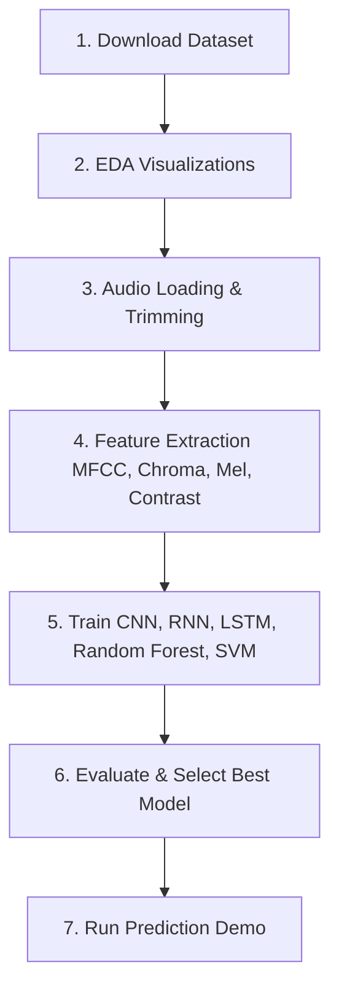

# Emotion Recognition from Speech (SER)

This repository contains a complete, end-to-end Machine Learning and Deep Learning project for **Emotion Recognition from Speech (SER)** using Python. The system classifies human speech into 8 distinct emotional categories: **neutral, calm, happy, sad, angry, fearful, disgust, and surprised**.

---

## 📁 Project Folder Structure

```
speech_recognition/
├── data/                         # Raw speech files (downloaded automatically)
├── results/                      # Output artifacts
│   ├── models/                   # Saved trained models and feature scalers
│   └── plots/                    # EDA charts and model learning curves
├── src/                          # Source modules
│   ├── __init__.py
│   ├── download.py               # Dataset downloader and extractor
│   ├── eda.py                    # Exploratory Data Analysis & visualizer
│   ├── feature_extraction.py     # Signal processing & feature extractor
│   ├── models.py                 # Neural network & ML architectures
│   ├── train.py                  # Training orchestrator & evaluator
│   └── predict.py                # Command-Line inference interface
├── main.py                       # Main pipeline execution entry-point
├── requirements.txt              # Package dependencies
└── README.md                     # Documentation
```

---

## 🛠️ Installation & Setup

1. **Clone or locate the workspace directory**:
   ```bash
   cd /Users/apple/Desktop/speech_recognition
   ```

2. **Install requirements**:
   Ensure you have Python 3.10+ (tested successfully on Python 3.13) and install the dependencies listed in `requirements.txt`:
   ```bash
   python3 -m pip install -r requirements.txt
   ```

---

## 🚀 Step-by-Step Project Workflow

The project is structured as an automated sequential pipeline:



### 1. Data Procurement & Preprocessing
The pipeline automatically downloads the official **RAVDESS Speech dataset** (Ryerson Audio-Visual Database of Emotional Speech and Song) zip archive (~208MB) from Zenodo and extracts it to the `data/` folder.
- **File Name Mapping**: Files like `03-01-05-01-01-01-01.wav` are parsed for the 3rd index which corresponds to the emotion.
- **Trimming and Padding**: Silent padding/fringes are trimmed using `librosa.effects.trim`. Clips are padded or truncated to a uniform duration of **3.0 seconds** at a sampling rate of 22.050 kHz to ensure identical shape inputs.

### 2. Feature Extraction
To transform raw audio waves into machine-readable numbers, four distinct acoustic features are extracted:
- **MFCC (Mel-Frequency Cepstral Coefficients)**: Captures the shape of the vocal tract and spectral envelope (40 dimensions).
- **Chroma STFT**: Captures the pitches and harmonic attributes of the voice (12 dimensions).
- **Mel Spectrogram**: Measures time-varying power distribution across Mel-scale frequencies (128 dimensions).
- **Spectral Contrast**: Measures valley-to-peak amplitude differences across sub-bands, capturing vocal texture and brightness (7 dimensions).

These features are stacked into a 2D sequence of shape `(130, 187)` for sequence/grid architectures (CNN, RNN, LSTM) and averaged over time into a 1D vector of shape `(187,)` for classical ML algorithms (Random Forest, SVM).

### 3. Exploratory Data Analysis (EDA)
The pipeline generates:
- **`emotion_distribution.png`**: Class counts validating the perfect balance of the RAVDESS dataset.
- **`waveforms_and_spectrograms.png`**: Side-by-side grids mapping the time-domain waveform and frequency-domain Mel Spectrogram for each emotion.
- **`eda_insights.txt`**: Documented acoustic properties observed (e.g., higher frequency energy in angry/fearful clips vs. lower concentration in sad/calm).

### 4. Deep Learning & ML Architectures
- **CNN (2D Convolutional)**: Treats sequence features as single-channel spectrogram images. Uses blocks of `Conv2D`, `BatchNormalization`, `MaxPooling2D`, and `Dropout` before flattening into a classifier head.
- **RNN**: Sequential model mapping temporal frames through stacked `SimpleRNN` layers.
- **LSTM**: Uses Bidirectional `LSTM` blocks to model forward and backward long-term dependencies in speech sequences.
- **Random Forest & SVM**: Scikit-Learn classifiers trained on the averaged 1D feature representations to serve as non-neural baselines.

### 5. Training, Evaluation, and Selection
Models are trained with an EarlyStopping callback to minimize validation loss. The script evaluates test-set performance, plots accuracy/loss histories, saves confusion matrices, and selects the model with the highest accuracy to save as the deployable production model.

---

## ⚡ Running the Pipeline

To execute the entire pipeline (Download ➔ EDA ➔ Feature Extraction ➔ Multi-Model Training ➔ Best Model Save ➔ Demo Inference):

```bash
python3 main.py
```

### Options:
- **Change Epochs & Batch Size**:
  ```bash
  python3 main.py --epochs 35 --batch_size 64
  ```
- **Predict on a Custom File**:
  ```bash
  python3 main.py --demo_file path/to/your/speech.wav
  ```
- **Skip Downloader (if dataset is already extracted)**:
  ```bash
  python3 main.py --skip_download
  ```

---

## 🔮 Predicting Emotions of New Audio Files

You can classify the emotion of any arbitrary `.wav` file using the trained model via:

```bash
python3 -m src.predict --file path/to/audio.wav
```

This prints a text-based distribution chart:
```
==================================================
Prediction Result for Audio File:
==================================================
PREDICTED EMOTION : ANGRY
CONFIDENCE LEVEL  : 92.45%
--------------------------------------------------
Probability Distribution:
Angry        : ███████████████████████████    92.5%
Fearful      : █                               4.2%
Happy        :                                 1.8%
Sad          :                                 0.8%
...
```
